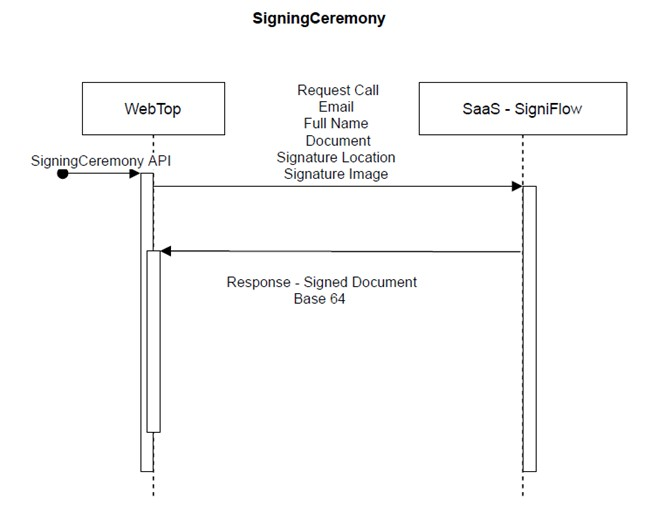
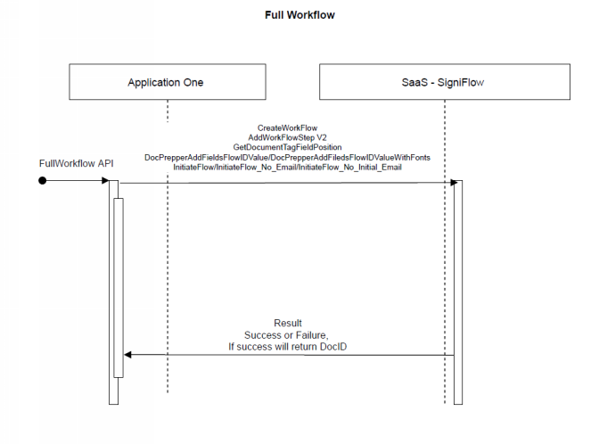

## SigniFlow Integration Overview
###### SigniFlow integrations options with various applications

### 1. SigniFlow Integrations

#### APPLICATION INTEGRATION INFORMATION

* Application integration with SigniFlow SaaS utilizing one API call.

* Application integration with SigniFlow utilizing multiple API Calls.

#### SigniFlow API Methods:

For creating a workflow, the following functions can be used in order:

##### 1.    [/Login](../SigniFlow API-OpenApi3Yaml.yaml/paths/~1Login/post)

This function authenticates the user and generates a token that will be used to make calls to the other API functions.
 
##### 2.    Create Workflow
https://flow.signflow.co.za/api/signflowapiservicerest.svc/help/operations/CreateWorkflow

This function uploads the document to SigniFlow and sets certain parameters for the workflow.
 
##### 3.    Add Workflow Step 
https://flow.signflow.co.za/api/signflowapiservicerest.svc/help/operations/AddWorkflowStepV2

This function adds users to the workflow to Sign, View or Approve documents. (This needs to be called for all the users in the workflow).
 
##### 4.    Get Tag Field Position 

https://flow.signflow.co.za/api/signflowapiservicerest.svc/help/operations/GetDocumentTagFieldPosition

This function is used to find the coordinate and page location of the specified text in a document.
 
##### 5.    Add Prepper Fields 

(https://flow.signflow.co.za/api/signflowapiservicerest.svc/help/operations/DocPrepperAddFieldsFlowIDValue)

This function adds the specified field to the document in the specified location.
 
##### 6.    Initiate Workflow

(https://flow.signflow.co.za/api/signflowapiservicerest.svc/help/operations/InitiateFlow)

his function starts the workflow process and the first person in the workflow will receive an email at this point.
 

All the above functions can be combined into one API call:

1.    Full Workflow 

(https://flow.signflow.co.za/api/signflowapiservicerest.svc/help/operations/FullWorkflow)

This function combines all the fields mentioned above and more into one API call.

2. Workflow Sign 

(https://flow.signflow.co.za/api/signflowapiservicerest.svc/help/operations/WorkflowSign)

If you want to sign a document that has been sent for workflow via API you can call the following API.

If you do not want to use the workflow engine but rather just sign the document and get it back immediately you can use one of the following Signing Ceremony methods:

Signing Ceremony 

(https://flow.signflow.co.za/api/signflowapiservicerest.svc/help/operations/SigningCeremony)

This function takes in the signer’s information, the document and signature along with the trust reference of how and where you authenticated the user, it will then sign the document. It will return a result field along with the signed document.
 
Signing CeremonyV2 

(https://flow.signflow.co.za/api/signflowapiservicerest.svc/help/operations/SigningCeremonyV2)

This function takes in the signers information, the document and signature along with the trust reference of how and where you authenticated the user. This function also can add fields such as Initials, Checkboxes, and textboxes to a document, it will then sign the document. It will return a result field along with the signed document.
 
Multiple Signers Signing Ceremony 

(https://flow.signflow.co.za/api/signflowapiservicerest.svc/help/operations/MultipleSignersSigningCeremony)

This function takes in a list of  signers information, the document and signatures along with the trust reference of how and where you authenticated the users in the list, it will then sign the document. It will return a result field along with the signed document.
 
If a document only needs to be certified using a company seal the following API can be used:
Certifying Ceremony 
(https://flow.signflow.co.za/api/signflowapiservicerest.svc/help/operations/CertifyingCeremony)

White Text Scripting:
 

GetDocumentTagFieldPosition

Service at https://flow.signflow.co.za/API/SignFlowAPIServiceRest.svc/GetDocumentTagFieldPosition

 
You can find some samples here:

https://update.signflow.co.za/index.php/s/JEdhHRdh1FNahQG
 
The zip files you can download that should be helpful is “RestAPI.zip” and “FullWorkflowRestAPI.zip”

O365 Integration

• O365 integration with SigniFlow Plugin, this can be used on Word, Excel and PowerPoint only with O365. There is an explanation on utilizing the Plugin with AzureAD and with SigniFlow Account Authentication.