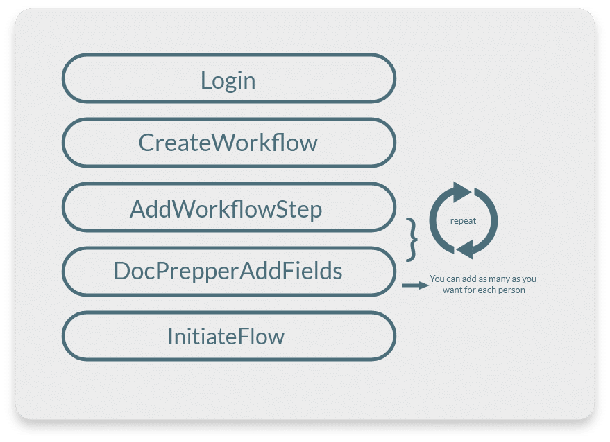
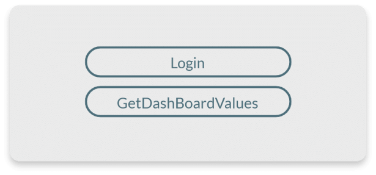
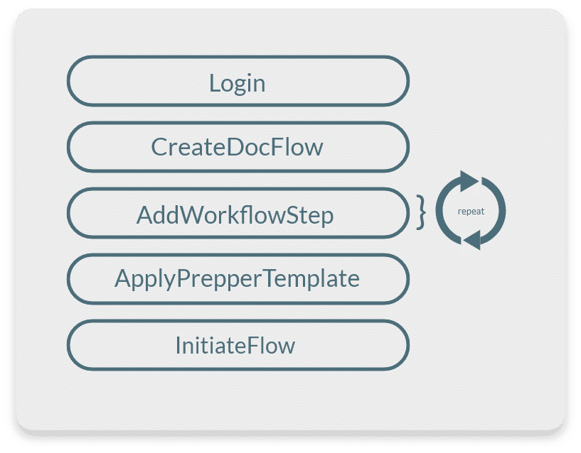
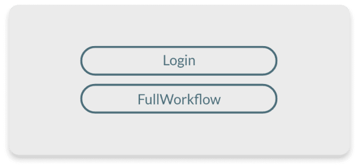

# 👋 Welcome Developers

## Getting started with the OpenAPI

The SigniFlow OpenAPI API is intended to manage the initiation, cancellation and removal of document workflows created within the SigniFlow system. The API will also manage the security control within the SigniFlow system and generation of workflow steps. 

---
## The Basics
---
### Creating a workflow

Creating A Workflow Is The Core Of SigniFlow There Are Multiple Ways In Which You Can
Create A Workflow But The Most Simple Way Is Displayed Here:

* [/Login](../../reference/SigniFlow-OpenAPI-v1.yaml/paths/~1Login/post)
  * Pass Through Your Account Username And Password.
  * Receive Back A [Token](../../reference/SigniFlow-OpenAPI-v1.yaml/components/schemas/TokenField) Which Is Used For Further Processes.

* [/CreateWorkflow](../../reference/SigniFlow-OpenAPI-v1.yaml/paths/~1CreateWorkflow/post) 
  * Pass Through: Your Token, Your Document (Base64 Encoded) & Other Information About The Workflow.
  * Receive Back A Document ID

* [/AddWorkflowStep](../../reference/SigniFlow-OpenAPI-v1.yaml/paths/~1AddWorkflowStepV2/post) 
  * Pass Through: The Document ID, Your Token & Information About The Person Being Added.
  * Receive Back Data Regarding The Step Added.

* [/DocPrepperAddFields](../../reference/SigniFlow-OpenAPI-v1.yaml/paths/~1DocPrepperAddFieldsFlowID/post) 
  * Pass Through: The Document ID, Your Token & Information About The Field Being Added.
  * Receive Back Data Regarding The Field Added.

* [/InitiateFlow](../../reference/SigniFlow-OpenAPI-v1.yaml/paths/~1InitiateFlow/post) 
  * Pass  Through: The Document ID, Your Token
  * Receive Back Data Regarding The Workflow.

---
### Download Your Document

Keep A Backup Of Your Documents As They Are Updated Or Completed, Feel Safe Knowing SigniFlow Keeps A Full Audit Of All Actions Taken On A Document Which Allows Us To Verify Any Downloaded Document With Our Backup.

Login -> Pass Through Your API Account Username And Password.
-> Receive Back a Token Which Is Used For Further Processes.

GetDoc ->Pass Through: Your API Token, Your Document ID.
->Receive Back a Document As A Base64 Encoded String As
Well As Other Information About The Document.
---
### Get Your Dash Board Information

Login -> Pass Through Your API Account Username And Password.
-> Receive Back a Token Which Is Used For Further Processes.

GetPrepperTemplateList ->Pass Through Your API Token.
->Receive Back All Of Your Dashboard Values Including How Many
Documents You can Still Create.

---

## Using Prepper Templates

---

### Fetch All Prepper Templates

Get All Your PrepperTemplates To Allow You To Select One To Apply To A WorkFlow.

Login -> Pass Through Your API Account Username And Password.
-> Receive Back a Token Which Is Used For Further Processes.

GetPrepperTemplateList ->Pass Through A Template Folder ID And Your API Token.
->Receive Back A List Of Prepper Templates.
---
### Creating a Workflow with a Doc Prepper Template

Creating a workflow is the core of SigniFlow there are multiple ways in which you can
create a workflow but the most simple way is displayed here:

Login -> Pass Through Your API Account Username And Password.
-> Receive Back a Token Which Is Used For Further Processes.

Create Docflow ->Pass Through: Your API Token, Your Document (Base64 Encoded) & Other Information About The Workflow.
->Receive Back a Document ID

AddWorkflowStep ->Pass Through: The Document ID, Your API Token & Information About The Person Being Added.
->Receive Back Data Regarding The Step Added.

ApplyPrepperTemplate ->Pass Through: The Document ID, Your API Token & a Template ID.
->Receive Back Data Regarding The Field Added.

InitiateFlow ->Pass Through: The Document ID, Your API Token
->Receive Back API Token from the login API.
---
## Some Advanced Features
---

### Creating a workflow in two steps

Login -> Pass Through Your API Account Username And Password.
-> Receive Back A Token Which Is Used For Further Processes.

FullWorkflow ->Pass Through: Your API Token, Your Document (Base64 Encoded),
All Users Who Will Be Included In The Workflow As Well As Where Their
Fields Should Be Placed & Other Information About The Workflow.
->Receive Back A Document ID And Other Information Regarding The
Workflow.

---
### Finding The Position Of Your Fields

If You Are Not Sure Where Your Fields Should Be Placed, Place White Text Where You Want Your Field To Be.

Login -> Pass Through Your API Account Username And Password.
-> Receive Back a Token Which Is Used For Further Processes.

CreateWorkflow ->Pass Through: Your API Token, Your Document (Base64 Encoded) & Other Information About The Workflow.
->Receive Back a Document ID

GetDocumentTagField -> Pass Through The Document ID, The Text To Search For And API Token.
-> Receive Back List Of Positions Where The Text Was Found.

---
## Signing Ceremonies
--- 

**TURN YOUR ONLINE APPLICATION INTO ITS OWN CRYPTOGRAPHIC SIGNATURE ENGINE AND HAVE YOUR CUSTOMERS SIGN ONLINE IN YOUR APP.**

The fastest cryptographic signature API on the market. The ‘Signature Ceremony API’ is a high-speed, convenient, purpose-built API that can be integrated with any web service where it is required for the signatory to digitally sign a document, using a third-party application.

### Signing Ceremony
Unlike standard SigniFlow APIs the ‘Signature Ceremony API’ does not utilise standard SigniFlow functions, workflow engine functions or the standard SigniFlow user-authentication process. Instead, it relies on the third-party application to perform certain - or all of these - functions, and pass the information (trust) to the ‘Signature API’, which will use the trust data received from the application to cryptographically sign the document and embed said information in the digital signature.

Trust in the form of authentication is transferred to the third-party application by reference, and only the signature operation is performed by the Signature API. It is therefore expected that the application performs multi-factor authentication of the user, before calling the API.

### Multiple Signers Ceremony
